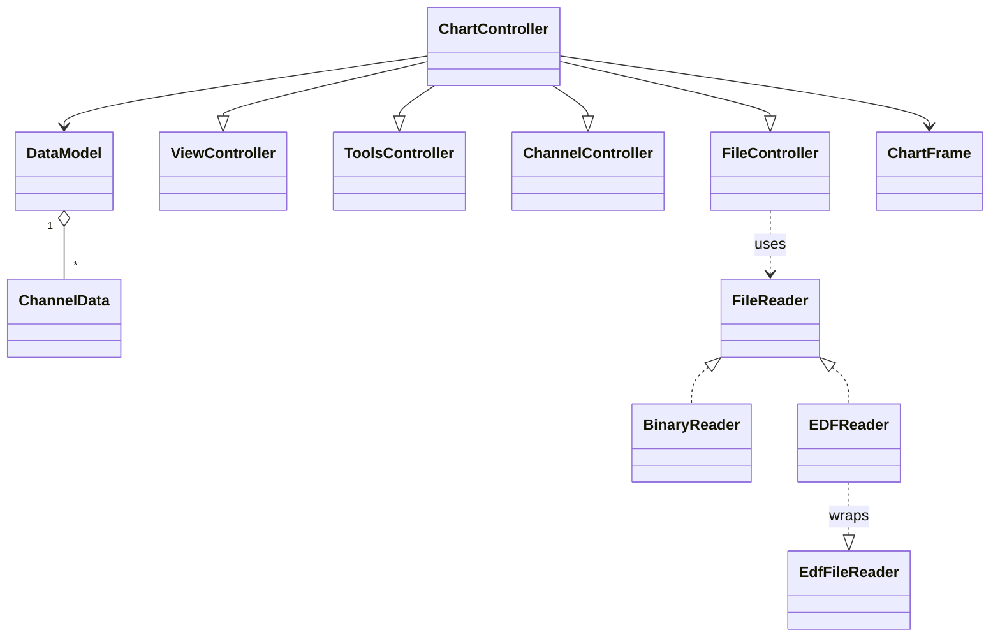
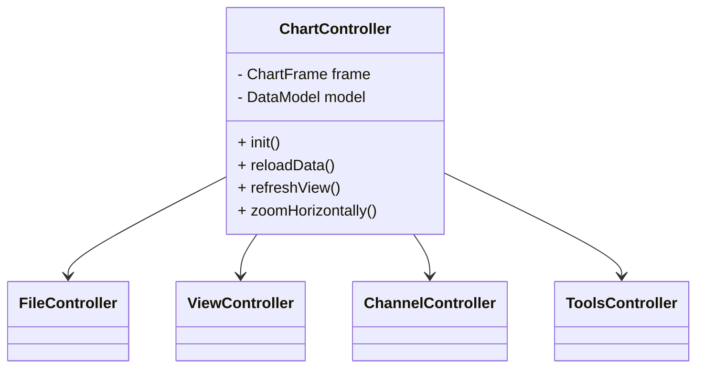
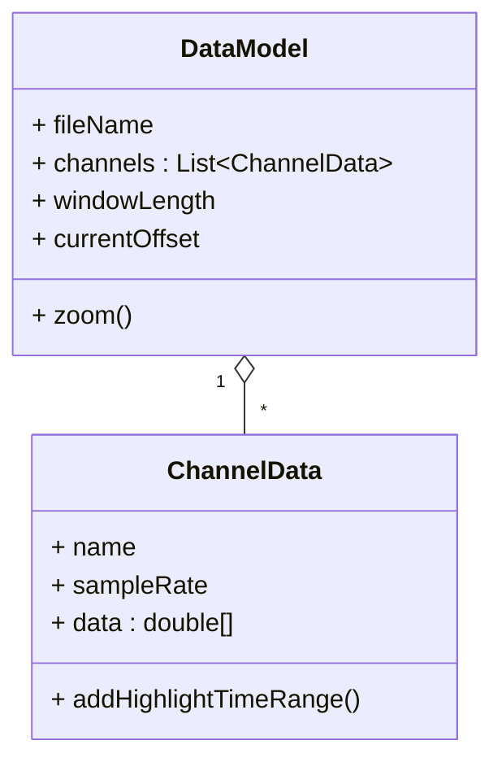
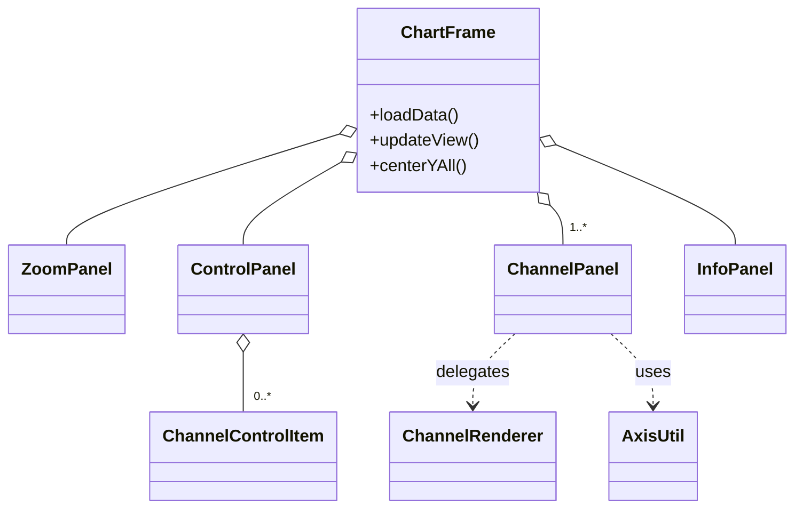
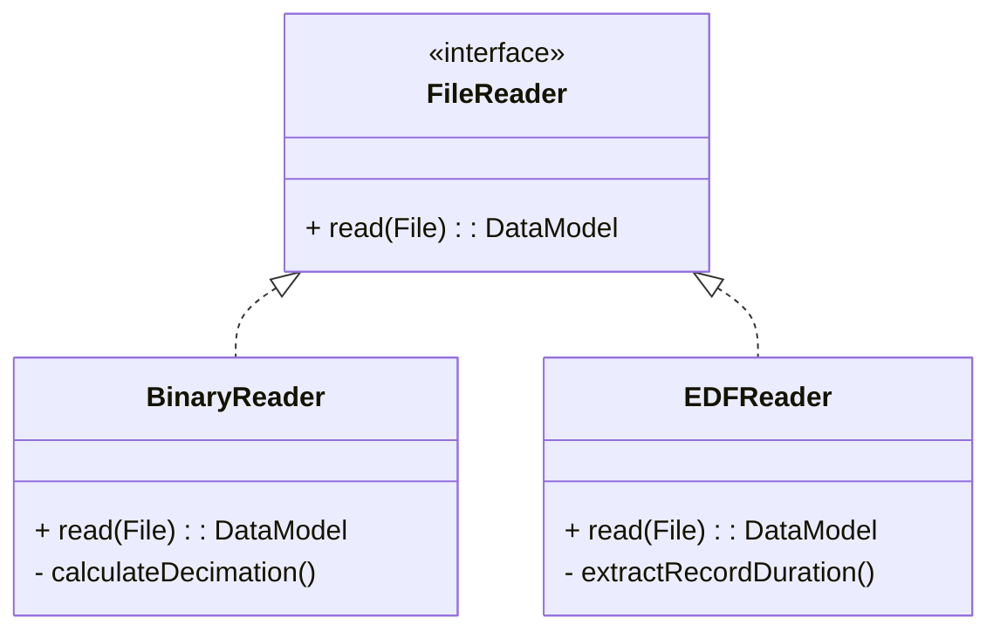
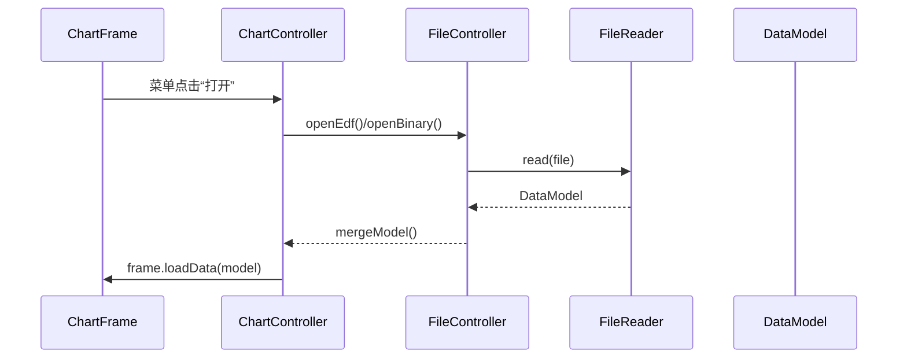

# Chart System 软件设计文档

## 1 系统设计 

### 1.1 设计目标

| 维度           | 目标                                                        | 量化标准                                                     |
| -------------- | ----------------------------------------------------------- | ------------------------------------------------------------ |
| **功能完整**   | 满足课堂需求 & 挑战要求1-2                                  | 所有用例通过演示验收                                         |
| **性能可接受** | 8 h EDF 文件 < 0.5 s 打开；离线渲染 > 60 fps；实时 > 25 fps | 采用 `BinaryReader` 分块 + 降采样；`ChannelRenderer` Clip + 双缓冲 |
| **可扩展**     | 新增文件格式/算法不改 UI                                    | 提供 `FileReader`、`ProcessingOperation` 插口                |
| **可维护**     | 模块独立、命名清晰、注释覆盖关键路径                        | 代码规范扫描 ≤ Level 3 issue                                 |

### 1.2 总体架构

系统采用经典 **MVC + 责任链** 组合结构：



**Controller 层**：`ChartController` 为统领，分派事件到四大子控制器；各子控制器只依赖 *Model* 与框架层 API，无直接的 Swing 访问。负责生命周期、菜单与多通道协作，聚合其它子控制器。




**Model 层**：`DataModel` 保存视窗状态与通道集合，`ChannelData` 负责采样数据与可视属性；实时模式通过 `PlaybackController`（线程安全）串联写入线程与 UI。



**View 层**：`ChartFrame` 组合多个 Swing 子面板；`ChannelPanel` 只做轻量绘制委托，重计算留给 `ChannelRenderer`。



**文件子系统**：使用策略模式，`FileReader` 抽象读取接口，现有 `BinaryReader`、`EDFReader` 两实现；导出由静态工具 `FileWriter` 统一处理。策略接口 `FileReader` 定义统一入口，具体格式以实现类扩展。



**信号处理子系统**：工厂 `OperationFactory` 负责根据枚举创建 `ProcessingOperation` 实例；每个实现自带 *metadata* 声明参数与窗口需求，方便 UI 动态渲染。

### 1.3 运行流程

### 1.3.1 打开文件 Sequence



### 1.3.2 渲染刷新

- 水平缩放/滚动直接修改 `DataModel` 中的 `windowLength` / `currentOffset`。
- `ChartFrame.updateView()` 只重新计算滚动条与 repaint，无重复解析。

### 1.4 关键算法

**大文件抽样降频**（`BinaryReader.calculateDecimationFactor()`）

```java
int factor = (int) Math.ceil(length / 1_000_000.0);
```

确保单通道内存 ≤ 1 M 样本；同时 `EDFReader` 亦使用相同策略，保证 UI 流畅。

**网格刻度自适应**：`AxisUtil.niceStep(range, ticks)` 产出 1–2–5×10^n 序列，兼顾视觉均衡与阅读性。

**心电监护模拟**：`VitalSim` 通过 **相位高斯叠加** + **可调基线漂移** 生成 ECG；BP/SpO₂/RESP 以 lookup-table + 噪声快速合成；写入通过 CAS 更新实时缓冲并唤醒 UI。

## 2 构建及接口设计 

### 2.1 代码组织与依赖

```
com.myapp.chart
 ├── ChartApp            // 入口，封装 EDT 调用
 ├── controller          // 5×Ctrl，纯业务逻辑
 ├── model               // POJO & 状态对象
 ├── view                // Swing 组件，零业务
 │   ├── channel         // 波形绘制相关
 │   ├── processing      // 处理对话框
 │   └── simulation      // 监护仪 UI
 └── file                // Reader/Writer 策略

com.biorecorder.edflib   // 第三方库，供 EDFReader 调用
```

依赖均为 **同层调用或低→高层禁止反向**，满足“最小依赖表面”原则。

### 2.2  公共接口清单

| 接口                                                         | 角色                | 说明                                 | 关键方法签名                                |
| ------------------------------------------------------------ | ------------------- | ------------------------------------ | ------------------------------------------- |
| `FileReader`                                                 | 文件适配层抽象      | 新增格式实现点                       | `DataModel read(File f)`                    |
| `ProcessingOperation`                                        | 信号算法抽象        | 新增处理算法实现点                   |                                             |
| `ChannelData process(ChannelData src, double p, int w, boolean ge)` |                     |                                      |                                             |
| `WindowProvider`                                             | 在线/离线统一时间轴 | 供 `ChannelPanel` 获取 offset/window | `int getOffset()` / `int getWindowLength()` |

### 2.4 异常与日志

| 范围     | 异常类型                                                     | 处理策略                                                     |
| -------- | ------------------------------------------------------------ | ------------------------------------------------------------ |
| 文件解析 | `IllegalStateException` / 第三方 `EdfHeaderRuntimeException` | `FileController.showError()` 弹窗                            |
| UI 线程  | 运行期 `RuntimeException`                                    | 全局 `Thread.setDefaultUncaughtExceptionHandler` 写 log/弹窗 |
| 实时线程 | I/O 失败、数组越界                                           | 捕获后写日志并安全停机                                       |