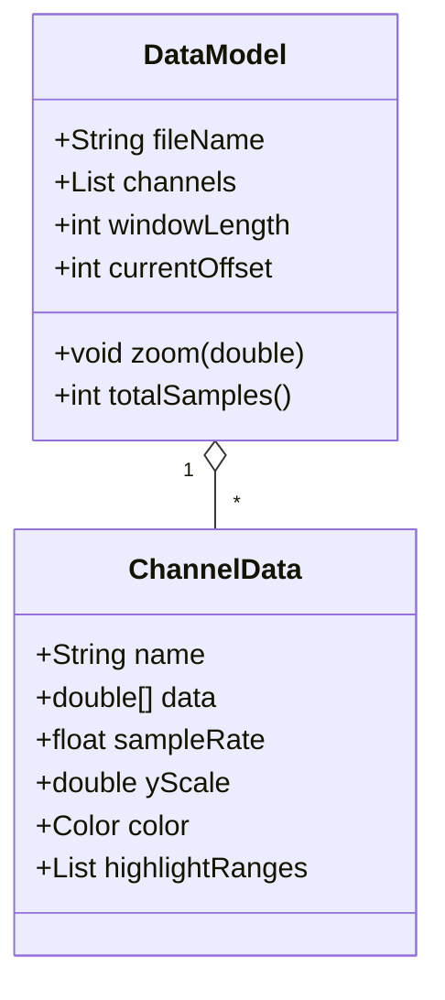
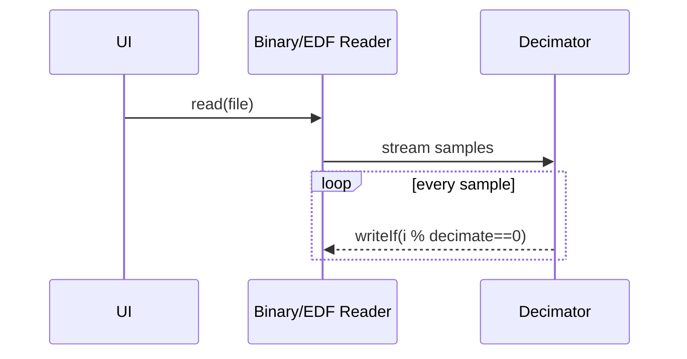
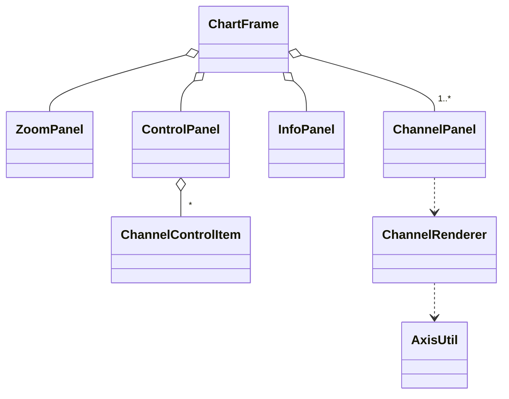

# Chart System 软件详细设计文档

## 1 数据结构介绍

### 1.1 核心领域对象



| 结构          | 设计目的                                                     | 约束                                  | 备注                                                 |
| ------------- | ------------------------------------------------------------ | ------------------------------------- | ---------------------------------------------------- |
| `DataModel`   | 持有**可变**视窗状态（`windowLength` / `currentOffset`）与所有通道 | *线程不安全*，只在 EDT 读写           | UI→Model 更新流程详见§3.2                            |
| `ChannelData` | 封装单通道波形与显示属性                                     | `data` 长度可动态扩容；颜色由哈希生成 | 高亮区段采用 *物理时间* 存储，避免因采样率不同而失准 |

## 2 使用的数据格式介绍

### 2.1 自定义二进制格式（*.bin）

**字节序**：小端 (Little‑Endian)。

**样本粒度**：每样本 `float32`，通道间**交织存储**。

**文件结构**：`[CH0‑S0][CH1‑S0] … [CHN‑1‑S0] | [CH0‑S1] …`，无文件头。打开时由用户输入 *通道数* 与 *采样率*。

**优势**：写入极简、无第三方依赖。缺点是缺乏元数据，需要 UI 侧交互补充。

### 2.2 EDF/BDF 标准格式

采用第三方库 **`biorecorder.edflib`**。核心流程：

1. `HeaderConfig` 解析 256 B + 256 B·ns 的头部；校验数字/物理范围。
2. `EdfFileReader` 按 *记录* 读取，将数字值转换为物理量 (`digital→physical`).

**支持性**：EDF 16‑bit 与 BDF 24‑bit 自动识别；异常映射到 `EdfHeaderRuntimeException` 并在 UI 弹窗。

### 2.3 内部缓存布局

| 缓存            | 所属模式      | 写入策略                   | 触发扩容                                   |
| --------------- | ------------- | -------------------------- | ------------------------------------------ |
| `double[] data` | 回放/监护共用 | 顺序写；`NaN` 表示尚未写入 | `PlaybackController.ensureCapacity()` 翻倍 |

## 3 处理算法描述

### 3.1 文件读取与抽样降频



**Decimation 因子** = ⌈`length / 1 000 000`⌉，保证单通道 ≤1 M 点。

Binary 读取按 *块* (`40 KiB`)；EDF 读取按 *DataRecord* 再按 `CHUNK_SAMPLES=4096` 解码。

### 3.2 视窗缩放 / 滚动

水平缩放 `factor` → `windowLength *= factor`；再裁剪上界 (`totalSamples`).

垂直滚动条值映射到 `scrollPos ∈ [‑1,1]`，在渲染时 **偏移中点**：`y0 = mid - visibleRange/2 + scrollPos*(fullRange-pad)`。


### 3.3 波形渲染 (ChannelRenderer)

**网格步长**：`AxisUtil.niceStep(range, ticks)` 返回 1/2/5×10ⁿ。

**坐标变换**：`mapY(v) = h - (v-base)/range * h`，左上角为 (0,0)。

**抗闪烁**：在 `Graphics2D` 子图层完成全部绘制后统一 `dispose()`。

### 3.4 信号处理操作

| 操作       | 对应类               | 主要算法                                          |
| ---------- | -------------------- | ------------------------------------------------- |
| 微分       | `DiffOperation`      | `y'[i] = x[i+1]-x[i]`，末位补 NaN                 |
| 积分       | `IntegrateOperation` | Simpson 1/3 法近似，Δt=1/fs                       |
| 移动平均   | `MovingAvgOperation` | 滑窗宽 *N*，首端补 NaN                            |
| 标记上下限 | `MarkOperation`      | 扫描并向 `highlightRanges` 写入 [startSec,endSec] |


------

## 4 代码文件介绍

4.1 目录树概览

```
com/myapp/chart/
 ├─ ChartApp.java            // 程序入口
 ├─ controller/
 │    ├─ ChartController.java
 │    ├─ FileController.java
 │    ├─ ViewController.java
 │    ├─ ToolsController.java
 │    └─ ChannelController.java
 ├─ model/
 │    ├─ DataModel.java
 │    └─ ChannelData.java
 ├─ file/
 │    ├─ FileReader.java (interface)
 │    ├─ BinaryReader.java
 │    ├─ EDFReader.java
 │    └─ FileWriter.java
 └─ view/
      ├─ ChartFrame.java
      ├─ ZoomPanel.java
      ├─ ControlPanel.java
      ├─ InfoPanel.java
      └─ channel/ …
```

### 4.2 控制器层

| 类                  | 功能                              | 关键方法                                    | 与其他层交互                               |
| ------------------- | --------------------------------- | ------------------------------------------- | ------------------------------------------ |
| `ChartController`   | **应用大脑**：菜单、缩放、时间轴  | `init()` 启动；`refreshView()` 触发 repaint | 持有 `DataModel`；调用 `ChartFrame` API    |
| `FileController`    | 文件对话框 + 读取策略选择         | `openBinary()` / `openEdf()`                | 调用 `FileReader.read()`，合并 `DataModel` |
| `ViewController`    | 只处理**视窗参数**：offset / zoom | `onHScroll()` / `zoomHorizontally()`        | 修改 `DataModel`，再让 Frame repaint       |
| `ChannelController` | 单通道导出 / 关闭                 | `exportChannel()` / `closeChannel()`        | 写文件并更新 UI                            |

### 4.3 文件读写层

| 类             | 功能摘要            | 特殊算法                                                     |
| -------------- | ------------------- | ------------------------------------------------------------ |
| `BinaryReader` | 纯 float32 文件解析 | 动态 `decimate`、块读取 40 KiB                               |
| `EDFReader`    | EDF/BDF → DataModel | 反射拿 `HeaderConfig` 的记录时长；对每通道 `readPhysicalSamples` |
| `FileWriter`   | TXT/BIN 导出工具    | 小端写入 `float`；UTF‑8 文本行写                             |

### 4.4 视图层（关键类图）



`ChannelPanel` 仅管理状态与滚动条；真正绘图全部在 `ChannelRenderer`，便于单元测试。

### 4.5 实时模拟子系统

`view.simulation.MonitorFrame` 创建 4 通道 & 启动 `VitalSim` 线程。

`VitalSim` 每 4 ms 写 1 样本，心率/血压/呼吸/血氧各自简易模型；写入时增量扩容。


------

## 5 用户界面介绍

### 5.1 主窗口布局


**缩放面板**：

- 「自动 X」按钮 —— 一键视窗 = 全文件长度。
- 时长预设按钮 —— 8 h / 1 h / 30 m / …
- 对数滑块 —— 10 %–1000 %。

**控制面板 (左)**：

- *复选框* → 显示/隐藏通道。
- *纵向 Slider* → (0.1×–10×) 对数缩放。
- *导出 / 关闭 / 上移 / 下移* 按钮。

**通道绘图区 (中)**：每通道独立背景+刻度；支持高亮区段透明叠加。

**信息面板 (右)**：

- 文件名 / 通道数 / 总时长。
- 若为 EDF，再显示病人信息、记录开始时间等 Header 字段。

**状态栏 (底)**：水平滚动条同步 `DataModel.currentOffset`。

### 5.2 对话框


| 对话框                      | 入口           | 要点                                                |
| --------------------------- | -------------- | --------------------------------------------------- |
| **统计 (StatisticsDialog)** | 菜单→工具→统计 | 多选通道→弹窗展示 *max/min/mean/var*；无选中→警告框 |
| **处理 (ProcessingDialog)** | 菜单→工具→处理 | 下拉选择操作；动态显示参数组件；执行后新增结果通道  |
| **导出 (ExportSimulation)** | 监护仪右侧按钮 | 支持“当前窗口/全部已录”两种范围                     |


## 6 源码定位、主要职责和交互关系

### 根包 `com.myapp.chart`

| 文件              | 角色                             | 关键点                                                | 典型调用者  |
| ----------------- | -------------------------------- | ----------------------------------------------------- | ----------- |
| **ChartApp.java** | *应用入口*；在 EDT 启动 Swing UI | ‑ 设置系统外观；‑ 调用 `new ChartController().init()` | Shell / JRE |

------

### `controller` 子包

| 文件                       | 主要职责                                              | 主要成员 / 方法                                              | 交互对象                                   |
| -------------------------- | ----------------------------------------------------- | ------------------------------------------------------------ | ------------------------------------------ |
| **ChartController.java**   | **应用中枢**：聚合其它控制器，处理菜单、缩放、滚动    | `init()` `refreshView()` `moveChannel()` 等                  | `ChartFrame`、`DataModel`、各子 Controller |
| **FileController.java**    | 打开二进制 / EDF 文件，合并数据模型                   | `openBinary()` `openEdf()`；私有 `mergeModel()`              | `BinaryReader` `EDFReader`                 |
| **ViewController.java**    | 管理**时间轴窗口**(offset, windowLen)；发起监护仪窗口 | `onHScroll()` `zoomHorizontally()` `PlaybackController`(静态内部类) | `ChartFrame` `DataModel`                   |
| **ToolsController.java**   | 菜单“工具”——统计/处理对话框调度                       | `showStatistics()` `showProcessing()`                        | `StatisticsDialog` `ProcessingDialog`      |
| **ChannelController.java** | 单通道导出 TXT/BIN；关闭 / 移动通道                   | `exportChannel()` `closeChannel()`                           | `FileWriter` `ChartFrame`                  |

------

### `model` 子包

| 文件                 | 职责                         | 重要字段                                                    | 线程模型                       |
| -------------------- | ---------------------------- | ----------------------------------------------------------- | ------------------------------ |
| **DataModel.java**   | **全局数据容器** + 视窗状态  | `List<ChannelData> channels` `windowLength` `currentOffset` | *非线程安全*，仅 EDT 修改      |
| **ChannelData.java** | 波形数据 + 显示属性 + 高亮段 | `double[] data` `sampleRate` `yScale` `highlightRanges`     | 与 UI 双向交互；颜色按哈希生成 |

------

### `file` 子包

| 文件                  | 功能定位                             | 亮点实现                                                   | 异常处理                                 |
| --------------------- | ------------------------------------ | ---------------------------------------------------------- | ---------------------------------------- |
| **FileReader.java**   | 统一读取接口 (strategy)              | `read(File)` 返回 `DataModel`                              | 子类抛出 `Exception` 由 UI 捕获          |
| **BinaryReader.java** | 解析自定义 *.bin*；自动抽样降频      | 块读取 40 KiB；`decimate = ⌈len/1e6⌉`                      | `IllegalStateException` 用于用户取消输入 |
| **EDFReader.java**    | 基于 *biorecorder.edflib* 解 EDF/BDF | 反射拿 `HeaderConfig.getDurationOfDataRecord*`; 按通道降频 | `EdfRuntimeException` 走 UI 提示         |
| **FileWriter.java**   | 通道导出 ⇒ TXT / BIN                 | 小端写 `float32`；UTF‑8 文本                               | GUI 弹窗提示成败                         |

------

### `view` 子包

| 文件                  | GUI 角色                           | 关键 UI 组件                                            | 交互点                                  |
| --------------------- | ---------------------------------- | ------------------------------------------------------- | --------------------------------------- |
| **ChartFrame.java**   | **主窗体**：布局菜单、面板、滚动条 | `ZoomPanel` `ControlPanel` `InfoPanel` `ChannelPanel`×N | 控制器调用 `loadData()` `updateView()`  |
| **ZoomPanel.java**    | 顶部时间缩放                       | 对数 `JSlider` + 时长按钮 + AutoX                       | 调 `ChartController.zoomHorizontally()` |
| **ControlPanel.java** | 左侧通道列表 + 操作                | 嵌套 `ChannelControlItem`                               | 触发导出/关闭/上移/缩放                 |
| **InfoPanel.java**    | 右侧元数据                         | `JTextArea` 只读                                        | 显示 EDF Header & 文件摘要              |

------

### `view.channel` 子包

| 文件                      | 责任                  | 重点实现                                    | 相关类                   |
| ------------------------- | --------------------- | ------------------------------------------- | ------------------------ |
| **AxisUtil.java**         | 坐标/刻度算法工具类   | `niceStep()` 取 1‑2‑5 序列；`mapY()`        | `ChannelRenderer`        |
| **ChannelConstants.java** | UI 魔法数集中管理     | 面板高度、网格数、默认采样率                | 所有 channel* 类         |
| **ChannelPanel.java**     | 单通道容器 + 垂直滚动 | 内含 `JScrollBar yScroll`；维护 `scrollPos` | `ChannelRenderer` 绘制   |
| **ChannelRenderer.java**  | 真正波形绘制者        | 计算网格 / 高亮 / 抗闪烁                    | `AxisUtil` `ChannelData` |

------

### `view.processing` 子包

| 文件                                       | 主要功能              | 说明                                                         |
| ------------------------------------------ | --------------------- | ------------------------------------------------------------ |
| **ProcessingDialog.java**                  | 通道处理入口对话框    | 动态控制参数区 (`ParamPanel`)、标记区 (`MarkTypePanel`)；执行 `OperationFactory.create()` |
| **ParamPanel.java**                        | 输入参数 / 窗口大小   | 根据选中操作显示/隐藏字段                                    |
| **MarkTypePanel.java**                     | 选择“>= / <=”标记类型 | 仅在 `MarkOperation` 可见                                    |
| **operation/ProcessingOperation.java**     | 操作接口 (Strategy)   | `process(ChannelData, double param, int win, boolean ge)`    |
| **operation/OperationFactory.java**        | 名称→实例映射         | 反射/显式 switch 生成                                        |
| **operation.Diff/Integrate/MovingAvg/...** | 具体算法实现          | Each implements `process()` & `needsParam()` etc.            |

------

### `view.simulation` 子包

| 文件                          | 作用                     | 关键点                            | 内部类                            |
| ----------------------------- | ------------------------ | --------------------------------- | --------------------------------- |
| **MonitorFrame.java**         | 心电监护仪模拟窗口       | 4 通道实时写；播放/暂停/导出      | `VitalSim` 后台线程，实现波形模型 |
| **SimulationStatsPanel.java** | HR/BP/SpO₂/RR 统计展示   | 简单峰值检测 & 平均计算           | —                                 |
| **ExportSimulation.java**     | 导出监护数据 TXT         | 支持“当前窗口 / 全部已录”         | —                                 |
| **WindowProvider.java**       | 抽象窗口参数供子组件复用 | `getOffset()` `getWindowLength()` | 由 `MonitorFrame` 实现            |

------

### `view.statistic` 子包

| 文件                      | 功能                    | 细节                                             |
| ------------------------- | ----------------------- | ------------------------------------------------ |
| **StatisticsDialog.java** | 多通道 max/min/mean/var | 结果用 `JTextArea` 滚动显示；`DoubleStream` 汇总 |

